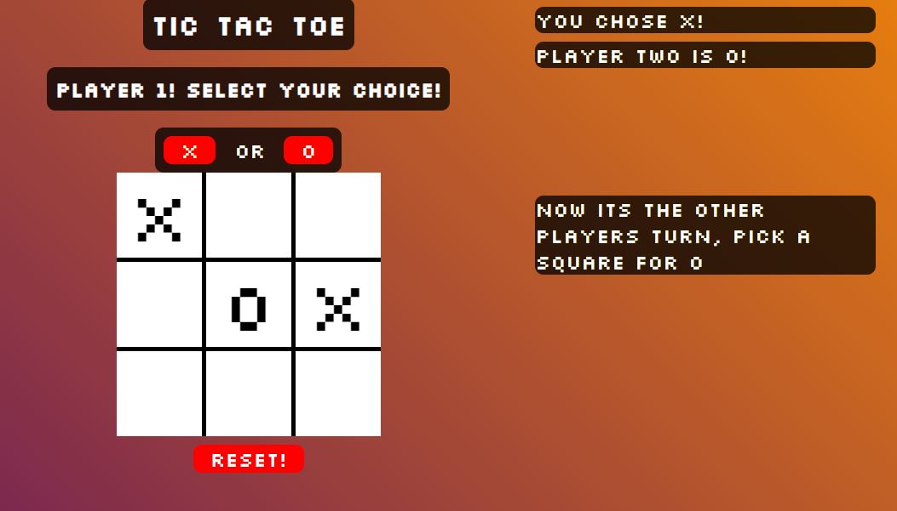

# Tic-Tac-Toe
### This project is an example of a Tic-Tac-Toe game using Javascript. 

## Description
A Tic-Tac-Toe game using the following skillsets
* Javascript
* Immediately invoked anonymous functions to eliminate pollution of global scope
* Class instantiation / Creating Objects to cache the DOM and other variables
* CSS variables for global styling
* CSS Pseudo-classes for hover and click transition events

## Demo
### Live: [Here](https://radclifferr.github.io/Tic-Tac-Toe/)

